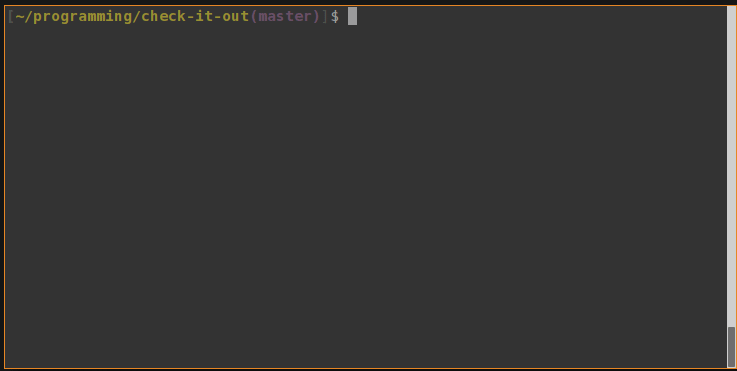
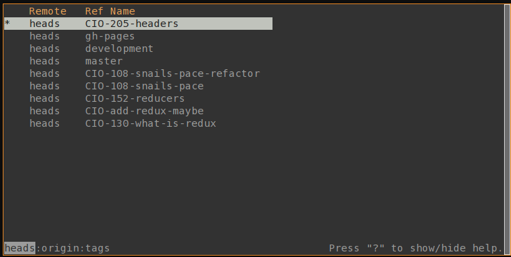

# Check It Out



Check it out, before you checkout.

Change branches with a single command. Check It Out visualizes branches and remotes in your current project. Long Branch Names? Forget it!

Fewer commands, fewer keystrokes, better productivity!

## Requirements
[Node >= v6.0](https://nodejs.org/en/blog/release/v6.0.0/)

[Git](https://git-scm.com/book/en/v2/Getting-Started-Installing-Git) - Required for core features

## Installation
We're on [NPM!](https://www.npmjs.org/package/check-it-out)
```
npm install -g check-it-out
```

#### Installing from source
[Fork](https://github.com/jwu910/check-it-out#fork-destination-box) or clone the repository
```
git clone https://github.com/jwu910/check-it-out.git
```

Navigate to your repository directory and run
```
npm install
```

Create a symbolic link to the entry point

###### Linux/Mac:
Navigate to a desired destination directory currently in your path.
```
ln -s /path/to/check-it-out/index.js checkit
```

## Usage
Run this command to list local and remote branches!
```
checkit
```



Call git log on current highlighted branch with `[space]`


| Commands | Description |
| -------- | ------------ |
|`j/k, down/up`| Navigate the list |
|`h/l, left/right`| Previous/Next remote |
|`r`| Refresh list with a fetch and prune |
|`enter`| Select highlighted item |
|`space`| Git log |
|`q, C-c, esc`| Quit |

## Contributing
Please refer to the [Contributing Guidelines](./CONTRIBUTING.md)

### License
MIT @ [Joshua Wu](https://www.npmjs.com/~jwu910)
