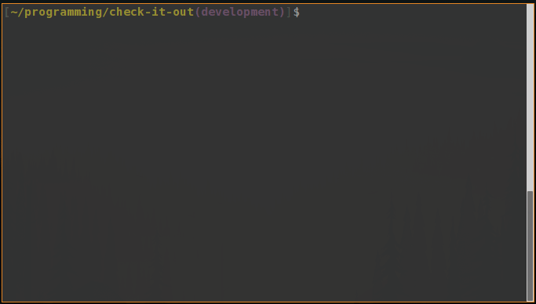
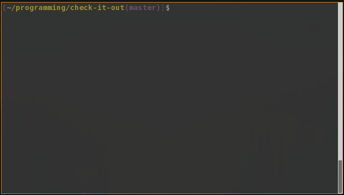
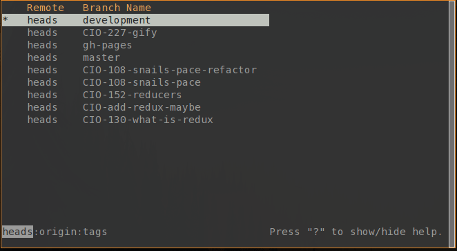

# Check It Out



Check it out, before you checkout.

Check It Out lets you interactively see and choose what branch you want to check out without the hassle of trying to type out a long or confusing branch name. Checking out branches just got even simpler!

## Requirements
[Node >= v6.0](https://nodejs.org/en/blog/release/v6.0.0/)

[Git](https://git-scm.com/book/en/v2/Getting-Started-Installing-Git) - Required for core features

## Installation
We're on [NPM!](https://www.npmjs.org/package/check-it-out)
```
npm install -g check-it-out
```

#### Installing from source
[Fork](https://github.com/jwu910/check-it-out#fork-destination-box) or clone the repository
```
git clone https://github.com/jwu910/check-it-out.git
```

Navigate to your repository directory and run
```
npm install
```

Create a symbolic link to the entry point

###### Linux/Mac:
Navigate to a desired destination directory currently in your path.
```
ln -s /path/to/check-it-out/index.js checkit
```

## Usage
Run this command to list local and remote branches!
```
checkit
```



Call git log on current highlighted branch with `[space]`




| Commands | Description |
| -------- | ------------ |
|`j/k, down/up`| Navigate the list |
|`h/l, left/right`| Previous/Next remote |
|`r`| Refresh list with a fetch and prune |
|`enter`| Select highlighted item |
|`space`| Git log |
|`q, C-c, esc`| Quit |

## Contributing
Please refer to the [Contributing Guidelines](./CONTRIBUTING.md)

### License
MIT @ [Joshua Wu](https://www.npmjs.com/~jwu910)

## Contributors
| [](https://github.com/jwu910) | [](https://github.com/drewbrokke) | [](https://github.com/jotchon) | [](https://github.com/casyjs) | [](https://github.com/bbenefield89) |
|------------------------------------------------------------------------------------------------------|---------------------------------------------------------------------------------------------------------------------------|-------------------------------------------------------------------------------------------------------|------------------------------------------------------------------------------------------------------|------------------------------------------------------------------------------------------------------------|